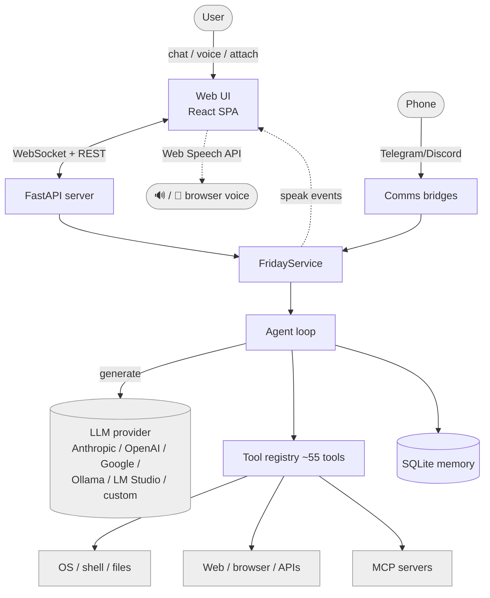
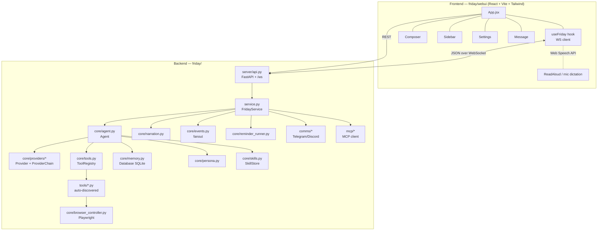
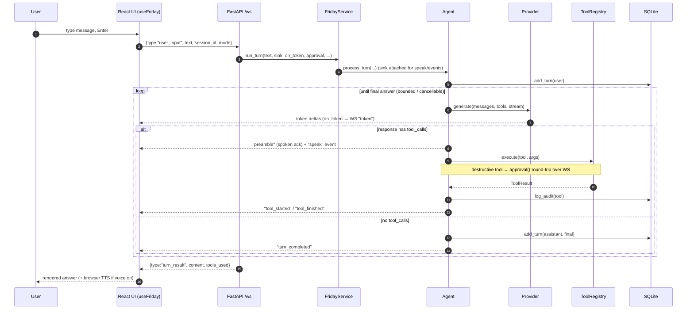
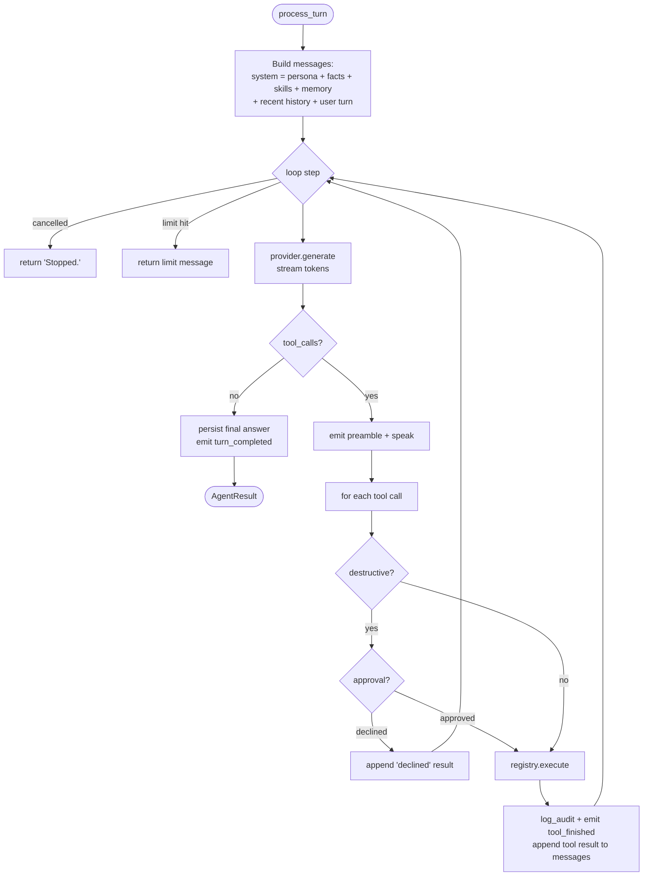
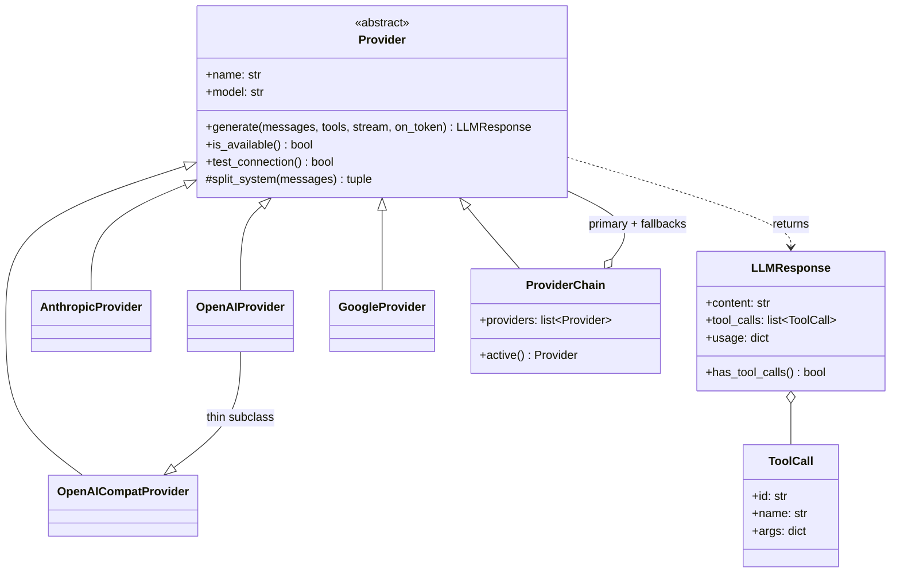
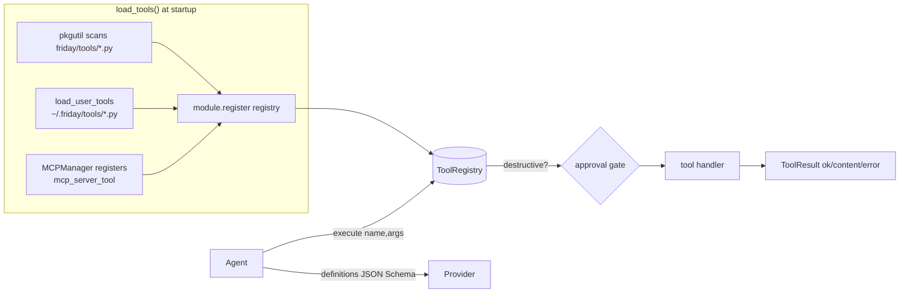
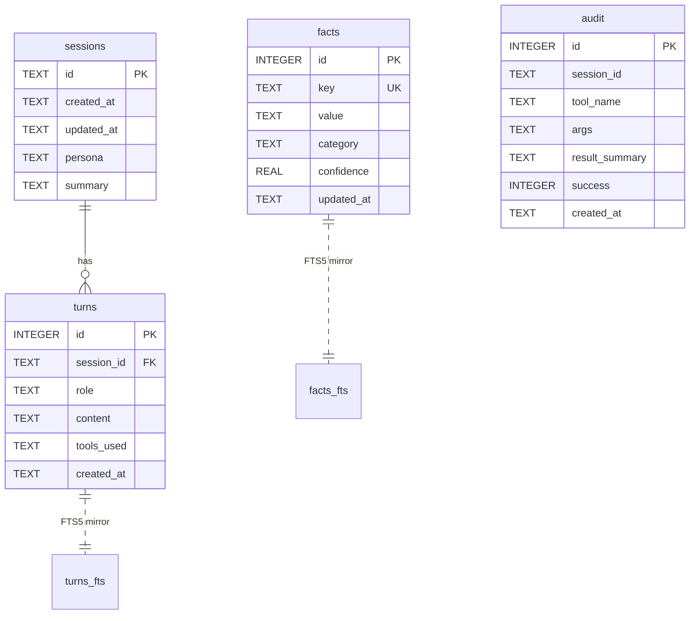
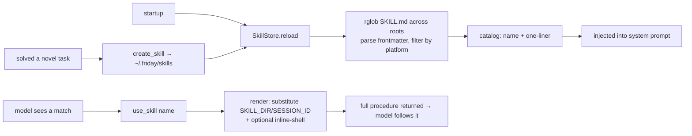
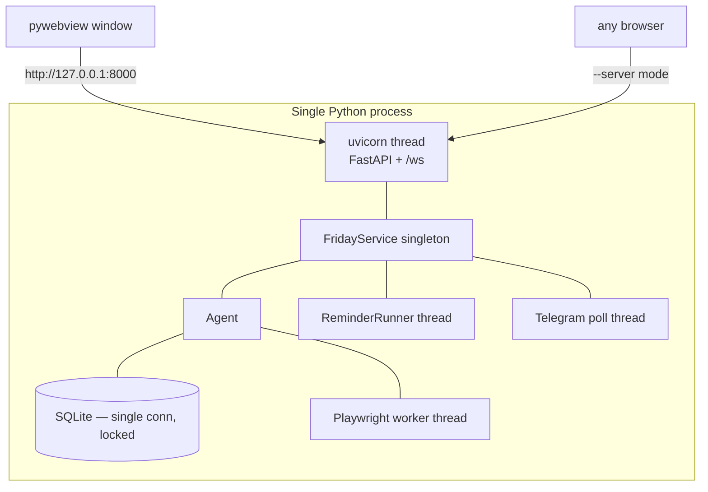

# FRIDAY — System Architecture

> This is the canonical, deep-dive description of how FRIDAY actually works, end
> to end. It covers every subsystem, the request lifecycle, the data model, and —
> in the final third — **every significant technical decision**: what the options
> were, what we chose, and why. Each UML diagram is a **rendered PNG** (in
> [`docs/diagrams/`](diagrams/)) so it shows in any Markdown viewer; the editable
> Mermaid source is kept in a collapsible block beneath each figure.

FRIDAY is a **cloud-only personal AI assistant**. The "brain" is a single LLM API
call; everything else is plumbing around that call: a tool registry, a memory
store, a skill system, a streaming web UI, and a few background bridges. The whole
application is the Python package [`friday/`](../friday). The display name
("FRIDAY") is configurable — see [Configuration](#11-configuration--the-assistant-name).

---

## 1. Design philosophy

Three principles shape the whole system:

1. **One loop, not a pipeline.** A turn is `generate → run tools → loop → answer`.
   There is no intent classifier, no planner, no routing graph. The model decides
   what to do by calling tools natively. (v1 had all three of those layers; see
   [§13](#131-cloud-only-vs-local-first-with-an-intent-pipeline-v1).)
2. **The model narrates, the browser speaks, the server stays stateless-ish.**
   Progress is emitted as events; audio happens in the browser; durable state is a
   single SQLite file.
3. **Everything is provider-agnostic and degrades gracefully.** Swap Anthropic for
   Ollama by editing one config key. Missing a system binary (e.g. `nmap`)? The
   tool returns a clear "install X" message instead of crashing.

---

## 2. System context

**Figure 1 — System context.**

Mermaid source

The user talks to a React single-page app over a WebSocket. The app reaches a
`FridayService`, which owns one `Agent`. The agent calls an LLM provider and a set
of tools, persists to SQLite, and streams events back. The same service is also
driven by the Telegram/Discord bridges, so you can chat with FRIDAY from your phone.

---

## 3. Component architecture

**Figure 2 — Component architecture.**

Mermaid source

| Layer | Files | Responsibility |
|------|------|----------------|
| **Launcher** | `app.py`, `__main__.py` | Start uvicorn in a thread; open a pywebview window (or browser). |
| **Server** | `server/api.py` | FastAPI REST + the `/ws` WebSocket turn channel; serves the built UI. |
| **Service** | `service.py` | Wires provider + tools + memory + agent + narration + bridges. One per process. |
| **Agent** | `core/agent.py` | The single turn loop. |
| **Providers** | `core/providers/` | Normalize every LLM behind one `Provider` interface + fallback chain. |
| **Tools** | `core/tools.py`, `tools/` | Registry + ~55 auto-discovered capability modules. |
| **Memory** | `core/memory.py` | SQLite: sessions, turns, facts (+FTS5), audit. |
| **Persona/Skills** | `core/persona.py`, `core/skills.py` | System prompt; procedural memory. |
| **Events/Narration** | `core/events.py`, `core/narration.py` | Pub/sub fanout; spoken progress lines. |
| **Bridges** | `comms/`, `mcp/`, `core/reminder_runner.py` | Messaging, MCP tools, scheduled reminders. |
| **Frontend** | `webui/` | React chat with streaming, timeline, voice, settings. |

---

## 4. The request lifecycle — one turn

This is the most important sequence in the system: what happens from a keystroke to
a streamed answer.

**Figure 3 — Request lifecycle — one turn.**

Mermaid source

Key points:

- **Streaming** — when the UI asks for tokens, the provider streams deltas straight
  to the socket as `token` events; the bubble fills in live.
- **Events are a fanout** — every step (`preamble`, `tool_started`, `tool_finished`,
  `speak`, `turn_completed`) is emitted once and fanned out to the narration engine
  and the WebSocket sink (`core/events.py:fanout`).
- **Approval is a blocking round-trip** — for a destructive tool, the agent calls
  the `approval(tool, args)` callback, which (over the socket) sends an
  `approval_request` and blocks a worker thread on a queue until the UI replies.
- **Cancellation** — a `stop` message flips a flag the loop checks every step.

---

## 5. The agent loop in detail

**Figure 4 — The agent loop.**

Mermaid source

- **System prompt assembly** (`Agent._build_messages` → `Persona.system_prompt`):
  persona identity + tone + dos/donts, the shared agent preamble (tool-routing
  rules), formatting rules, the **skills catalog**, the **curated memory block**
  (`USER.md` + `MEMORY.md`), `USER_FACTS`, and a periodic memory nudge. In **chat
  mode** all of that tool/skill machinery is dropped — it's a pure conversation with
  no tools.
- **`tool_loop_limit <= 0` means unlimited** — the user drives complex multi-tool
  tasks, and the Stop button is the control. A positive value is a hard cap.
- **Tool results** are appended as `role:"tool"` messages and the loop continues, so
  the model sees outcomes and can chain steps.

---

## 6. Provider layer

Every LLM is normalized behind one interface so the rest of the system never sees
provider-specific shapes.

**Figure 5 — Provider layer (class diagram).**

Mermaid source

- **`generate()`** returns a normalized `LLMResponse` with `content`, `tool_calls`
  (already parsed into neutral `ToolCall`s), and `usage`. Tool definitions go in as
  JSON Schema and are translated to each vendor's tool format inside the provider.
- **`OpenAICompatProvider`** is the workhorse: any endpoint that speaks
  `/v1/chat/completions` (Ollama, LM Studio, opencode, vLLM, a custom base URL).
  `OpenAIProvider` is a thin subclass.
- **`ProviderChain`** wraps a primary + ordered fallbacks. If the active provider
  errors or is unavailable, the next is tried — configured via `provider.fallback`.
- **`from_config(config)`** builds the right provider (or chain) from `config.yaml`.

---

## 7. Tool system

**Figure 6 — Tool system.**

Mermaid source

- **Auto-discovery** — every file in `friday/tools/` that exposes `register(registry)`
  is imported and registered at boot. Adding a capability = adding a file. No
  central list, no intent regex.
- **Neutral definitions** — a tool is `(name, description, json_schema, handler,
  destructive)`. The model reads the description + schema to decide when to call it.
- **Approval gate** — tools flagged `destructive=True` (shell, file deletes, smart-home
  mutations, `create_tool`, …) must pass the per-turn `approval` callback before they
  run, unless `conversation.auto_approve` is set.
- **`ToolResult`** carries `ok`, `content` (what the model sees), optional `error`,
  and structured `data`. Errors are returned, not raised, so a failing tool is just a
  message the model can react to.
- **Self-authored tools** — `create_tool` writes a new module to `~/.friday/tools/`
  and hot-loads it (see [SELF_MODIFICATION.md](SELF_MODIFICATION.md)).

---

## 8. Memory model

One SQLite file (`data/friday.db`), thread-safe single connection.

**Figure 7 — Memory model (ER diagram).**

Mermaid source

- **`facts`** = durable key/value facts about the user (`remember_fact`), with a
  standalone **FTS5** index for fuzzy recall.
- **`turns`** = full conversation history with a **FTS5** index over content for
  cross-session keyword recall (`search_conversations`). Sessions get auto-summarized
  when a new one starts.
- **`audit`** = every tool call (name, args, result, success) for traceability.
- **Curated notes** — beyond SQLite, `core/memory_notes.py` maintains human-readable
  `USER.md` + `MEMORY.md` that the agent edits and that are injected into the prompt.
  This is the "what the assistant chooses to remember in prose" layer.

### 8.1 Project knowledge bases (multi-document RAG)

Projects carry their own document shelf (≤ 25 files, ≤ 10 MB each), stored in
`project_documents` + `doc_chunks` (+ a `doc_chunks_fts` BM25 index):

1. **Ingest** (`core/docindex.py`) — text extraction (MarkItDown/pypdf/docx),
   then **prompt-injection screening** (`core/docscan.py`: instruction
   overrides, role-marker smuggling, hidden unicode, exfiltration/tool-call
   directives). Flagged files are indexed but **quarantined** out of retrieval
   until the user trusts them. Clean text is chunked structure-aware (~1.5k
   chars, heading breadcrumbs as section labels, tail overlap within sections).
2. **Retrieve** — the agent calls `search_project_documents`; the question is
   sanitised into FTS5 OR-prefix terms, BM25-ranked, diversified per document,
   and adjacent chunks are stitched back together. Excerpts are returned with
   file/section citations, wrapped in a *data-not-instructions* guard.
3. **Continuity** — a project chat's scope block also lists summaries of the
   project's earlier sessions (auto-summarized when a new project chat opens),
   with `search_project_history` for verbatim recall — so conversations days
   apart share context.

### 8.2 Learning Room state

`learning_topics` gained `preferences` (standing teaching instructions, set in
the topic's **path chat** via `set_teaching_preference` and honored in every
module). Cross-module continuity comes from **module recaps**: completing a
module saves a recap (concepts + the running example) into the topic's scope
memory, which every later module's prompt carries. `core/learning_nudge.py`
adds opt-in stale-topic Telegram nudges.

---

## 9. Skills (procedural memory)

A skill is a folder with a `SKILL.md` (YAML frontmatter + markdown body) in the
*Anthropic Agent Skills* format. Two roots: bundled (`friday/skills/`) and learned
(`~/.friday/skills/`).

**Figure 8 — Skills at runtime.**

Mermaid source

The **learning loop**: the model is told to call `create_skill` after solving a
novel multi-step task, and `update_skill` to refine one. Learned skills override
bundled ones on name collision. Full detail in [SKILLS.md](SKILLS.md).

---

## 10. Server, events, and voice

**WebSocket protocol** (`/ws`) — JSON messages both ways:

| Inbound (UI→server) | Outbound (server→UI) |
|---|---|
| `user_input {text, session_id, mode}` | `token {text}` — streamed answer delta |
| `approval_response {id, approved}` | `preamble {text}` — spoken acknowledgement |
| `password_response {id, password}` | `tool_started` / `tool_finished` |
| `stop` — cancel the turn | `approval_request {id, tool, args}` |
| `stop_speech` — barge-in | `password_request {id, prompt}` |
| `ping` | `speak {text}` — voice this in the browser |
| | `stop_speaking` — cancel browser TTS |
| | `turn_result {content, tools_used}` / `stopped` / `error` |

**Voice is 100% browser-native** (Web Speech API). The backend produces no audio:
narration's short spoken lines are emitted as `speak` events; the UI voices them via
`speechSynthesis` when the voice toggle is on, and reads answers aloud on demand
(`ReadAloud`). The mic uses `webkitSpeechRecognition` to dictate into the composer.
There is no Piper, no Whisper, no server-side STT. (See
[§13.13](#1313-browser-web-speech-api-vs-server-side-piper--whisper).)

---

## 11. Configuration & the assistant name

- **Base config**: `friday/config.yaml` (documented, commented).
- **Overlay**: `friday/config.local.yaml` — written by the Settings panel via
  `config.update_config`; the base file is never rewritten.
- **Secrets**: `.env` at the repo root (loaded by a tiny built-in parser).
- **Resolution**: `$FRIDAY_CONFIG` → `friday/config.yaml`.

The **assistant's display name** is the single source of truth in `assistant.name`
(or the `ASSISTANT_NAME` env var), resolved by `config.assistant_name()`. It flows
into the system prompt (persona identity uses a `{name}` placeholder), the UI
(`/api/config` → title/greeting/sidebar/composer), the about tool, and Telegram.
`FRIDAY_*` env-var names are intentionally fixed.

---

## 12. Process & deployment model

**Figure 9 — Process & deployment.**

Mermaid source

- One process. `python -m friday` runs uvicorn in a daemon thread and opens a
  pywebview window; `--server` skips the window (headless, open a browser).
- Background work runs on dedicated threads: the reminder runner, the Telegram long-poll,
  and the Playwright browser (the sync API must live on one thread).
- State is the single SQLite file + `~/.friday/` (user skills, user tools, browser
  profile) + `data/` (reminders, tasks, uploads). No external services required.

---

## 13. Technical decisions — options, choices, and why

Each decision below lists the realistic alternatives, what FRIDAY chose, the reason,
and the trade-off we accepted.

### 13.1 Cloud-only vs local-first with an intent pipeline (v1)
- **Options:** (a) keep v1 — local GGUF model + `intent_recognizer` (3,500-line regex
  router) + a planning engine + a routing stack; (b) cloud-only single agent loop.
- **Chosen:** (b). The brain is an API call; v1's intent/planning/routing layers were
  deleted.
- **Why:** modern hosted models call tools natively and reason well enough that the
  deterministic intent layer became negative value — every new capability needed a
  regex *and* a planner entry. The loop is ~200 lines vs thousands.
- **Trade-off:** a hard dependency on a provider (network + key), and less determinism.
  Mitigated by supporting **local** OpenAI-compatible servers (Ollama/LM Studio), so
  "cloud-only" still runs fully offline if you want.

### 13.2 Single agent loop vs ReAct/planner frameworks
- **Options:** LangChain/LangGraph agents, a custom planner-executor, or a plain loop.
- **Chosen:** a plain `while` loop calling `provider.generate` with tools.
- **Why:** native tool-calling already encodes "think → act → observe." A framework
  would add a large dependency and indirection for behavior we get in a few dozen lines.
- **Trade-off:** we hand-roll streaming, cancellation, and approval. That code is small
  and fully under our control, which we preferred to a framework's abstractions.

### 13.3 Native tool calling vs text-parsed ReAct
- **Options:** parse `Action: …` out of model text, or use the provider's structured
  tool-call API.
- **Chosen:** native structured tool calls (normalized to `ToolCall`).
- **Why:** structured calls are reliable, typed, and support parallel calls; text
  parsing is brittle and model-specific.
- **Trade-off:** providers without tool APIs need the OpenAI-compat path; pure
  text-only models aren't first-class.

### 13.4 Provider abstraction + OpenAI-compat vs an SDK per provider / a meta-SDK
- **Options:** one giant SDK (LiteLLM/LangChain), or hand-written providers behind a
  shared interface.
- **Chosen:** a thin `Provider` ABC with native Anthropic/OpenAI/Google subclasses plus
  a generic OpenAI-compat client.
- **Why:** the surface we use (generate + tools + streaming) is small; owning it avoids
  a heavy transitive dependency and keeps response normalization explicit. One compat
  client covers the long tail (Ollama, LM Studio, vLLM, custom).
- **Trade-off:** we maintain four providers, but each is small and rarely changes.

### 13.5 Fallback chain vs single provider
- **Options:** single configured provider, or a primary + ordered fallbacks.
- **Chosen:** `ProviderChain` (primary then fallbacks).
- **Why:** resilience to a provider outage / rate limit / a local server being down,
  with zero app-code changes.
- **Trade-off:** a failover can change model behavior mid-session; acceptable for a
  personal assistant.

### 13.6 JSON-Schema tools + file auto-discovery vs a plugin/entry-point system
- **Options:** setuptools entry points, a manifest/registry file, or convention-based
  discovery.
- **Chosen:** drop a `friday/tools/<name>.py` with `register(registry)`; it's imported
  at boot.
- **Why:** lowest friction — one file ships a capability, and the schema *is* the spec
  the model routes from. No regexes, no central list to keep in sync.
- **Trade-off:** import-time errors in one tool are caught and logged (it's skipped)
  rather than failing the whole app; you trade strictness for robustness.

### 13.7 Approval gating vs sandboxing tool execution
- **Options:** run everything in a container/jail, or run in-process behind an approval
  prompt.
- **Chosen:** in-process execution, with `destructive` tools gated by a per-turn approval
  round-trip (plus an opt-in auto-approve and a lab-mode gate for security tools).
- **Why:** the assistant's value *is* acting on your machine; a sandbox would block the
  point. Human-in-the-loop on the dangerous subset is the pragmatic safety boundary.
- **Trade-off:** trust in the model + the user. We mitigate with approval, audit logging,
  destructive classification, and security tools defaulting off.

### 13.8 Single-file SQLite vs Postgres / a vector DB
- **Options:** Postgres, a vector store (v1 used Chroma), or SQLite.
- **Chosen:** one SQLite file with FTS5.
- **Why:** zero-ops, single-user, local-first; FTS5 gives good keyword recall without a
  server or embedding pipeline. v1's Chroma + six "domain stores" were overkill for one
  person's assistant.
- **Trade-off:** no semantic (embedding) search and no multi-writer concurrency. For a
  single-user app neither matters; see 13.9.

### 13.9 FTS5 keyword recall vs embedding/vector search
- **Options:** embed turns and do ANN search, or full-text keyword search.
- **Chosen:** FTS5 keyword search + curated prose notes.
- **Why:** no embedding model/dependency/cost, deterministic, debuggable, and "find that
  thing I mentioned" is mostly lexical. The curated `USER.md`/`MEMORY.md` cover the
  "important context, always in prompt" need that vectors are often used for.
- **Trade-off:** misses paraphrase-only matches. Acceptable, and re-addable later behind
  the same memory interface.

### 13.10 Curated prose notes vs pure automatic memory
- **Options:** fully automatic (store everything, retrieve by similarity) vs an explicit
  curated layer the agent writes.
- **Chosen:** both — automatic turn/fact storage **and** agent-curated `USER.md`/`MEMORY.md`
  injected every turn.
- **Why:** the highest-value context (who the user is, ongoing projects, preferences)
  should be *always present and human-auditable*, not hoped-for from a retrieval hit.
- **Trade-off:** the agent must maintain the notes; prompt size grows. Bounded and worth it.

### 13.11 Skills as SKILL.md folders vs hardcoded workflows / fine-tuning
- **Options:** bake procedures into code, fine-tune the model, or store them as data the
  model loads on demand.
- **Chosen:** Markdown skill folders (Anthropic Agent Skills format) discovered at runtime,
  with a create/update learning loop.
- **Why:** procedures become editable data, portable across models, and the model can
  *author its own* — no retraining, no redeploy. Catalog-in-prompt + load-on-demand keeps
  the context cost to one line per skill until needed.
- **Trade-off:** skills are advisory (the model may ignore them) and unsandboxed text; we
  accept that for flexibility.

### 13.12 Self-authoring tools in-process vs sandboxed plugins
- **Options:** forbid runtime code-gen; sandbox authored tools; or write + hot-load them
  in-process.
- **Chosen:** `create_tool` writes a module to `~/.friday/tools/` and imports it live —
  **approval-gated**.
- **Why:** lets the assistant genuinely extend itself for capabilities no tool covers,
  which is a core goal.
- **Trade-off:** model-written code runs with app privileges. The approval gate + the
  "prefer create_skill (no code) when possible" guidance are the controls. (See
  [SELF_MODIFICATION.md](SELF_MODIFICATION.md).)

### 13.13 Browser Web Speech API vs server-side Piper / Whisper
- **Options:** server TTS (Piper) + server STT (faster-whisper + sounddevice), or the
  browser's built-in `speechSynthesis` + `SpeechRecognition`.
- **Chosen:** browser-native voice; the backend produces no audio and has no STT.
- **Why:** removes heavy native dependencies (Piper binary + ONNX voices, whisper models,
  PortAudio) and a whole audio-hardware failure surface; the browser already ships capable
  TTS/STT; and it works correctly when the server is remote (audio belongs on the client,
  not the server host). Narration is still server-decided — emitted as `speak` events and
  voiced in the browser.
- **Trade-off:** voice quality/availability depends on the browser (Web Speech STT is
  Chromium-best), and there's no voice when accessed by a non-speech client. Acceptable
  for a web-first assistant.

### 13.14 WebSocket streaming vs SSE / long-polling
- **Options:** Server-Sent Events, polling, or a WebSocket.
- **Chosen:** one WebSocket for the whole turn channel.
- **Why:** turns are bidirectional — tokens and tool events stream down *while* approval
  and password responses and stop/barge-in flow up. SSE is one-way; polling is laggy.
- **Trade-off:** slightly more connection management (reconnect logic in the hook).

### 13.15 React SPA + pywebview vs Electron / Tauri / server-rendered
- **Options:** Electron, Tauri, an htmx/server-rendered UI, or a Vite React SPA served by
  FastAPI and shown in pywebview.
- **Chosen:** Vite + React + Tailwind, built to static files FastAPI serves, opened in a
  lightweight pywebview window (browser fallback).
- **Why:** a streaming chat UI is genuinely stateful and benefits from React; pywebview is
  far lighter than bundling Chromium (Electron) and needs no Rust toolchain (Tauri); and
  the exact same bundle works in any browser for `--server` mode.
- **Trade-off:** a Node build step for the UI. The built `dist/` is committed so running
  the app needs no Node.

### 13.16 Playwright real-browser control vs headless / the `webbrowser` module
- **Options:** just shell out to `webbrowser.open`, drive a headless browser, or drive the
  user's real visible browser.
- **Chosen:** Playwright driving the **real** browser binary on a copy of the real profile,
  with a graceful `webbrowser` fallback.
- **Why:** media playback and control (YouTube/YT-Music play/pause/seek/fullscreen) need a
  live, signed-in, visible page; headless gets blocked ("something went wrong") and the
  stdlib module can't control playback.
- **Trade-off:** Playwright + a browser are heavyweight optional deps; the single-thread
  sync API needs a dedicated worker thread. Both are isolated and optional.

### 13.17 A hand-written MCP stdio client vs the official MCP SDK
- **Options:** depend on the `mcp` SDK, or implement the JSON-RPC-over-stdio handshake.
- **Chosen:** a small persistent stdio client (`initialize → tools/list → tools/call`).
- **Why:** the protocol slice we need is tiny; avoiding the SDK keeps dependencies and
  version-coupling down, and the client registers each server's tools as
  `mcp_<server>_<tool>` straight into the same registry.
- **Trade-off:** we track the spec manually if it evolves. Cheap for the surface used.

### 13.18 Config base + local overlay vs a single mutable file or env-only
- **Options:** one mutable `config.yaml` the UI rewrites, env-vars only, or a commented
  base + a machine-written overlay.
- **Chosen:** base `config.yaml` (hand-edited, documented) + `config.local.yaml` (UI-written
  overlay), deep-merged, secrets in `.env`.
- **Why:** the UI can persist settings **without** clobbering the documented, commented base
  file, and you can diff what you changed from defaults.
- **Trade-off:** two files to reason about; the loader's merge order is the contract.

### 13.19 Configurable name via `{name}` placeholder vs a templating engine
- **Options:** a templating library (Jinja), per-surface string tables, or a single token
  substituted late.
- **Chosen:** one `assistant_name()` source of truth + a `{name}` placeholder substituted
  when rendering the prompt, with the UI reading the name from `/api/config`.
- **Why:** trivially simple, no dependency, and impossible to half-apply — the prompt is
  rendered in one place and the UI threads one prop. `FRIDAY_*` env names are deliberately
  excluded so secrets/identifiers stay stable.
- **Trade-off:** a literal `{name}` in unrelated text would be substituted; in practice it
  appears only where intended.

### 13.20 `delegate_task` sub-agent vs a multi-agent framework
- **Options:** a full multi-agent orchestrator (CrewAI/AutoGen style), or one bounded
  sub-agent tool.
- **Chosen:** a single `delegate_task` tool that runs a sub-agent over a **read-only**
  research toolset and can't recurse into itself.
- **Why:** it collapses v1's Delegate/MoA/ResearchAgent into one understandable primitive
  that handles "go research this" without orchestration complexity or runaway recursion.
- **Trade-off:** no rich agent-to-agent collaboration. Sufficient for the assistant's needs.

---

## 14. Where to go next

- Build your own capabilities → [EXTENDING.md](EXTENDING.md)
- How skills work in depth → [SKILLS.md](SKILLS.md)
- How the assistant rewrites itself → [SELF_MODIFICATION.md](SELF_MODIFICATION.md)
- Setup & run → [../README.md](../README.md)
