# FRIDAY AI Assistant — Architectural Graphics and Diagrams Reference

This document serves as the single, unified master graphics reference for the **FRIDAY AI Assistant**. It covers all structural layers, single-turn lifecycles, voice I/O pipelines, parallel task execution engines, unified storage facades, and stateful multi-turn workflow engines.

All diagrams are written in GFM-supported **Mermaid** syntax, checked for semantic correctness, and aligned with the actual **v2 codebase architecture**.

---

## 1. High-Level Core & Bootstrap Layer

### 1.1 High-Level Architecture & Layer Map
This flowchart showcases how individual layers interact, separating deterministic routing from LLM-based parallel task execution, backed by a unified memory facade.

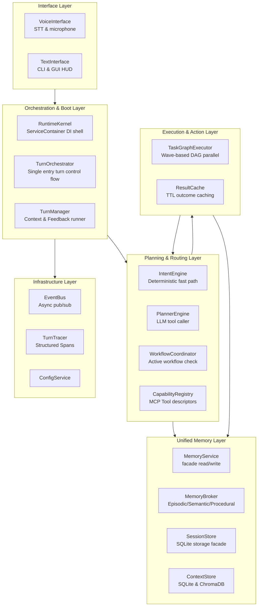

### 1.2 Bootstrap Sequence
This sequence details how `main.py` boots the `RuntimeKernel`, registers all active service dependencies inside the `ServiceContainer`, and links back-compat facades for the underlying `FridayApp`.

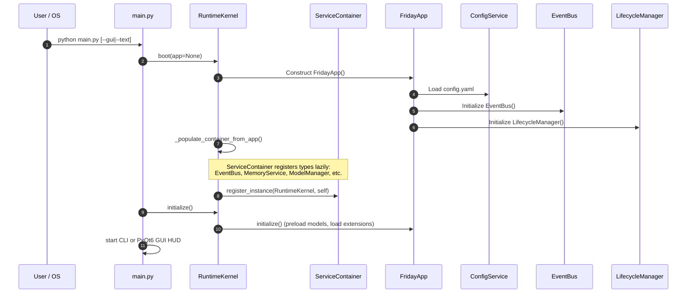

### 1.3 Runtime & Kernel Class Diagram
The structure of the dependency-injection shell that manages lazy registration and lifecycle operations for the services catalog.

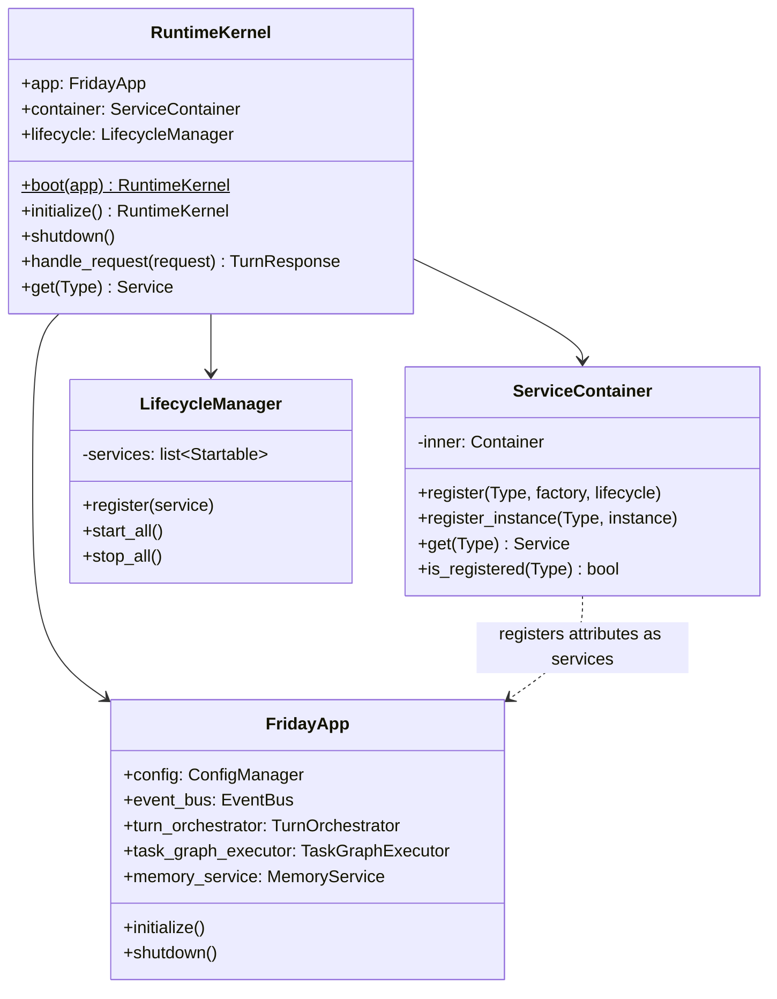

---

## 2. Single-Turn Lifecycle & I/O Pipeline

### 2.1 TurnOrchestrator Sequence Flow (Unified Dispatch Path)
This details the single control flow for all turns under the v2 refactor, bypassing fragmented routes and executing tools deterministically or through wave-based DAG graphs.

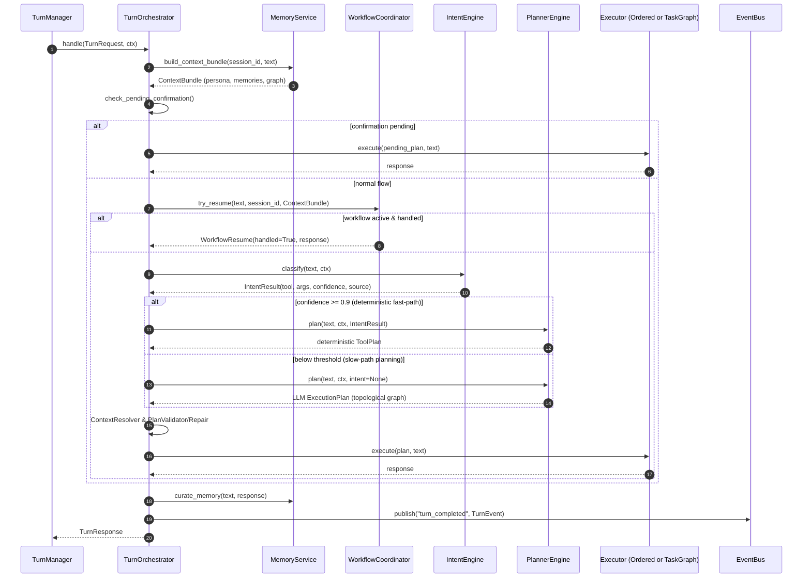

### 2.2 Voice I/O Pipeline & Barge-In
The full audio loop, detailing microphone capture, openwakeword activation, Whispering, safety layers, and async TTS interruption.

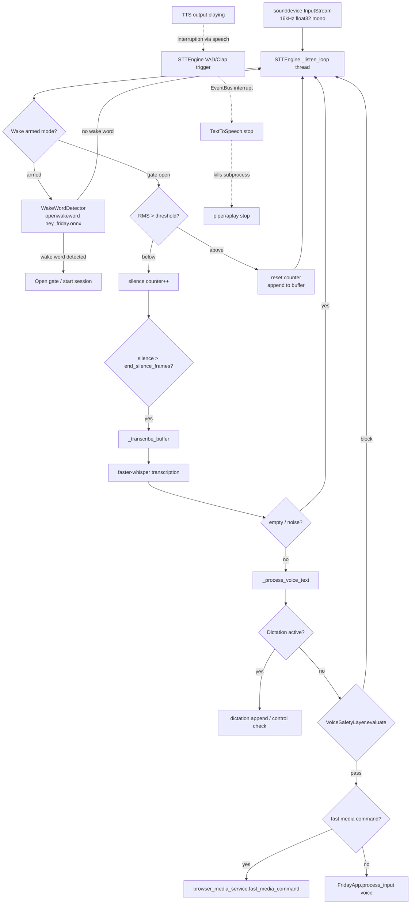

---

## 3. Planning & Routing Layer

### 3.1 Planning Systems Class Diagram
Illustrates the relationship between the `IntentEngine` (fast path), `PlannerEngine` (slow path), and downstream dependency nodes.

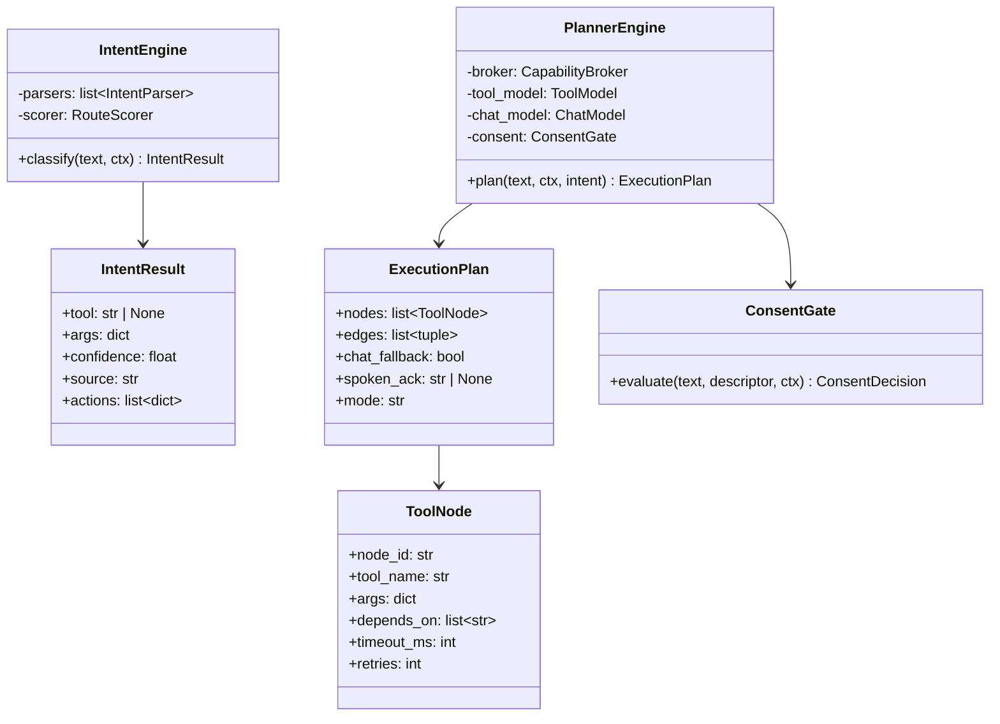

---

## 4. Execution Layer & Concurrency

### 4.1 TaskGraphExecutor Topological Wave Parallelism
How sequential actions are compiled into an execution Directed Acyclic Graph (DAG) and run concurrently inside a wave-based thread pool.

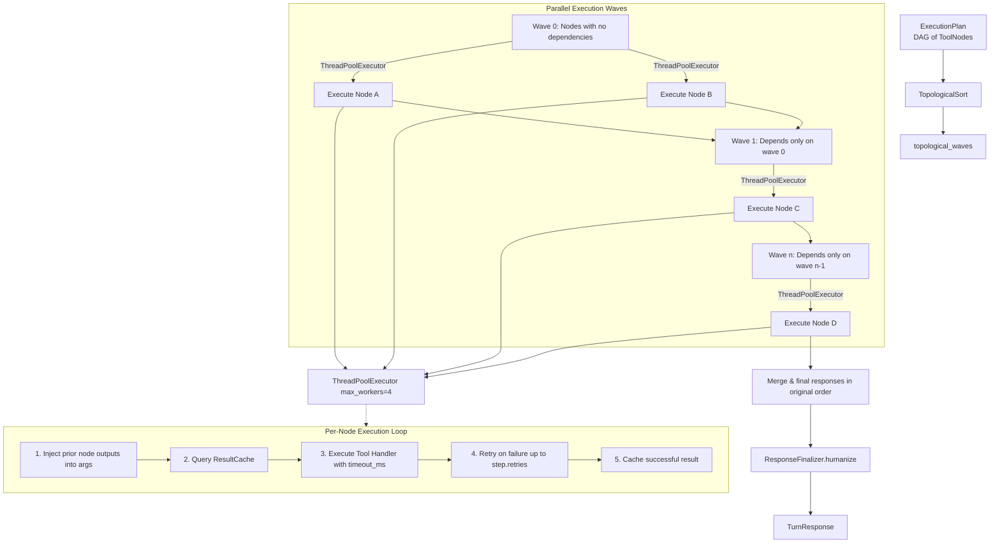

### 4.2 Concurrency & Inference Lock Domains
Structure of localized Locks separating conversational/chat requests from heavy background tools execution.

```mermaid
flowchart TD
    subgraph main_loop ["Asyncio Event Loop (Main Thread)"]
        TO[TurnOrchestrator]
        IE[IntentEngine\nno lock needed]
        PE[PlannerEngine]
    end

    subgraph tool_pool ["Tool LLM Execution Pool"]
        QW[Qwen 7B\ntool_inference_lock: asyncio.Lock]
    end

    subgraph chat_pool ["Chat LLM Execution Pool"]
        GM[Gemma 2B\nchat_inference_lock: asyncio.Lock]
    end

    subgraph bg_executors ["Background Pools (Async / Threaded)"]
        RA[ResearchAgent\nresearch_executor\nmax_workers=3]
        GWS[WorkspaceAgent\ngws_executor\nmax_workers=2]
        BMS[BrowserMediaService\nworker thread]
    end

    PE -->|Qwen plan request| QW
    PE -->|Gemma chat response| GM
    PE -.-> bg_executors
    
    note for QW "Separate locks prevent background research from blocking direct voice turn planning."
```

---

## 5. Memory Facade & Storage Architecture

### 5.1 Memory Facade Class Diagram
The single read/write interface wrapping low-level sqlite Context Stores and semantic/episodic Chroma vector indices.

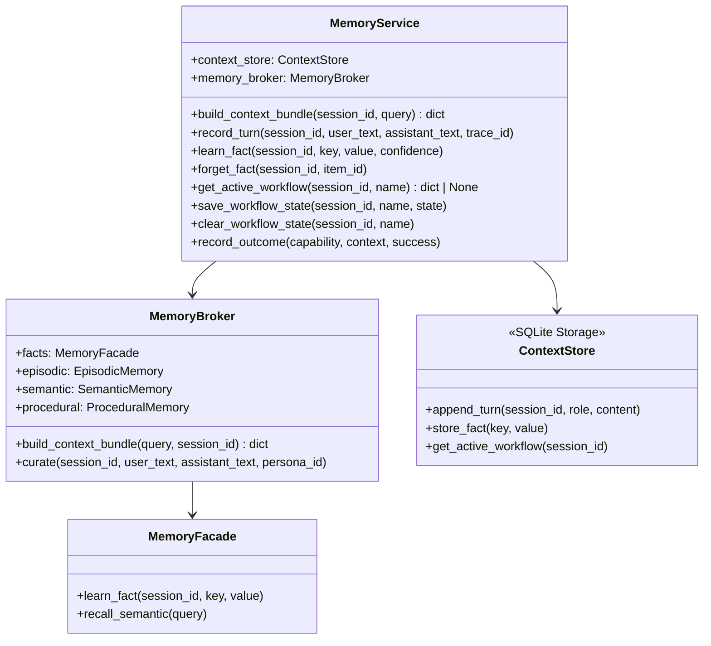

### 5.2 User Profile Paradox (Session Isolation vs. Global Facts)
This details how global profile entries (onboarding name) are synchronized vs. why isolated session databases might return blank results unless bridged.

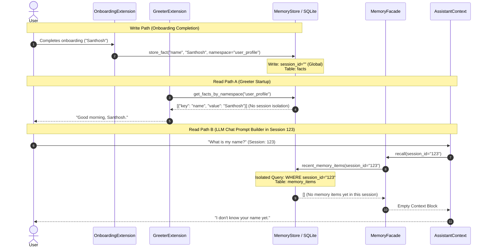

---

## 6. Stateful Workflows & Automation Engine

### 6.1 Stateful Workflow Transition State Machine
Visualizes workflow lifecycle phases, transition gates, slot-filling, and cancellation.

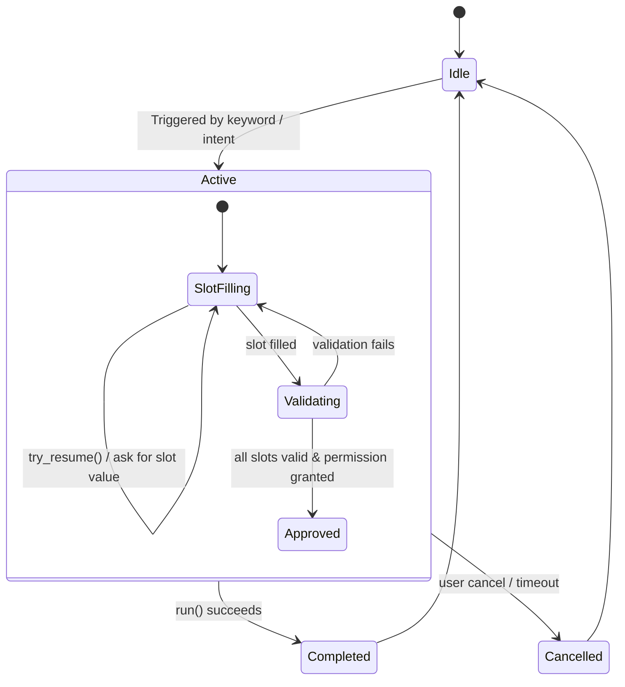

### 6.2 YAML Template Compilation & Multi-Turn Resume Sequence
This demonstrates how custom automation YAML templates are parsed, validated against capabilities, and executed interactively turn-by-turn.

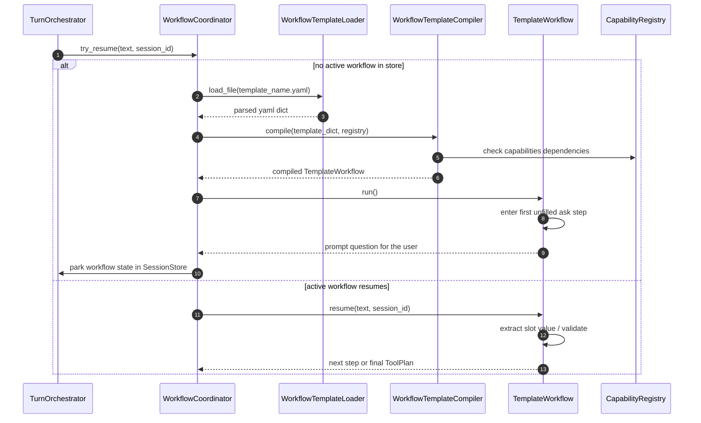
