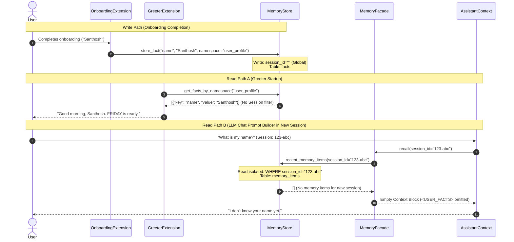

# Architectural Audit: User Profile Memory Retrieval Gaps and Session Isolation Paradox

**Date:** May 20, 2026  
**Status:** Memory Subsystem Audit & Logic Analysis  
**Auditor:** Antigravity (Google DeepMind Team)  

---

## 1. Executive Summary

This report analyzes a persistent user experience paradox in the **FRIDAY Linux** memory subsystem:
* **The Symptom:** During the first-run onboarding phase, the user successfully enters their details (such as name, role, etc.). When launching a subsequent session, the voice/terminal startup greeter warmly welcomes the user by their correct name (e.g., *"Good morning, Santhosh. FRIDAY is online and ready."*). However, when the user asks the assistant a direct identity question (e.g., *"What is my name?"*), the LLM replies that it does not know their name.
* **The Culprit:** The issue is caused by a structural divergence between the **Global Namespace Store** and **Session-Isolated Memory Store**, magnified by a **Python dictionary comprehension ordering bug** and a **signature-swapping logic confusion** between the `MemoryService` and the `MemoryBroker`.

This document trace outlines the exact database schema gaps, logical execution traces, and proposed resolution paths to restore seamless persistent context recall without violating the consolidation window guidelines.

---

## 2. Database Architecture & Schema Divergence

To understand the core retrieval paradox, we must map the two SQLite tables owned by the `MemoryStore` (`core/stores/memory_store.py`) that host user facts.

### 2.1 The `facts` Table (Global & Namespace-Based)
Used primarily by onboarding and legacy systems to record key-value pairs associated with namespaces (e.g., `"user_profile"` or `"system"`).

| Column | Type | Description |
| :--- | :--- | :--- |
| `session_id` | `TEXT` | Session identifier. **Onboarding completes with `session_id = ""` (global scope)**. |
| `namespace` | `TEXT` | The partition identifier (e.g., `"user_profile"`). |
| `key` | `TEXT` | Fact identifier (e.g., `"name"`). |
| `value` | `TEXT` | Stored fact value (e.g., `"Santhosh"`). |
| `updated_at` | `TEXT` | UTC timestamp of last update. Sorted descending. |

### 2.2 The `memory_items` Table (Session-Isolated)
Used by `SemanticMemory` and the `MemoryFacade` to record high-confidence facts indexed alongside embedding vectors in ChromaDB.

| Column | Type | Description |
| :--- | :--- | :--- |
| `item_id` | `TEXT` | Unique ID. Semantic facts are written as `sem:<session_id>:<key>`. |
| `session_id` | `TEXT` | **Strictly isolated by the active, running `session_id`**. |
| `memory_type` | `TEXT` | Explicitly marked as `"semantic"`. |
| `content` | `TEXT` | Preformatted text string for vector lookup (e.g., `"name: Santhosh"`). |
| `metadata_json`| `TEXT` | Stringified JSON holding `{key: "name", value: "Santhosh", confidence: 1.0}`. |

---

## 3. The User Profile Paradox: Exact Read/Write Trace

The diagrams and call flows below expose why the greeter works perfectly while the LLM remains blind to the user's details across sessions.



### 3.1 The Write Path (How Onboarding Stores Facts)
Upon completing the five-step slot-fill loop, `OnboardingExtension._handle_complete_onboarding` (`modules/onboarding/extension.py#L259`) iterates through `PROFILE_FIELDS` and invokes `write_profile_field`:
```python
def write_profile_field(context_store, field: str, value: str) -> None:
    ...
    context_store.store_fact(field, value or "", namespace=PROFILE_NAMESPACE)
```
Because no `session_id` is supplied to `store_fact`, it defaults to `""`. The row in the `facts` table is saved globally with **`session_id = ""`**.

### 3.2 Read Path A: Why the Greeter Works
When the application starts, `GreeterExtension._address_term` (`modules/greeter/extension.py#L377`) calls `read_user_profile(store)` which delegates to `modules/onboarding/extension.py#L75`:
```python
def read_profile(context_store) -> dict:
    ...
    rows = context_store.get_facts_by_namespace(PROFILE_NAMESPACE)
    ...
```
`MemoryStore.get_facts_by_namespace` queries:
```sql
SELECT key, value FROM facts WHERE namespace = 'user_profile' ORDER BY updated_at DESC
```
**Notice that there is no session filtering.** The query fetches the globally written onboarding facts, allows the greeter to extract `"Santhosh"`, and successfully addresses the user.

### 3.3 Read Path B: Why LLM Prompt Assembly Fails
During chat messages construction, `AssistantContext.build_chat_messages` retrieves context:
```python
bundle = memory_service.build_context_bundle(self.session_id, query) or {}
facts = bundle.get("user_facts")
```
This routes through `MemoryBroker.build_context_bundle` to **`MemoryFacade.render_user_facts(session_id)`** (`core/memory/facade.py#L285`):
1. Because `keys` is not explicitly provided, it calls `self.recall(session_id, limit=10)`.
2. `MemoryFacade.recall` delegates key-value scanning to `self._lookup_value`:
   ```python
   items = self._store.recent_memory_items(session_id, limit=100, ...)
   ```
3. `MemoryStore.recent_memory_items` runs:
   ```sql
   SELECT ... FROM memory_items WHERE session_id = ? ORDER BY updated_at DESC
   ```
4. **Because `session_id` is the new active session ID, the SQLite query returns `[]`.** The onboarding facts are stored in the `facts` table with `session_id = ""` and were never copied to `memory_items` for the new session.
5. As a result, the `<USER_FACTS>` system-prompt tags remain empty, and the LLM has no contextual knowledge of the user's name.

---

## 4. Key Gaps & Logic Wiring Issues

Beyond the session isolation paradox, our codebase audit uncovered several secondary bugs and design frictions directly impacting profile memory.

### Gap 1: The Python Dictionary Comprehension Overwrite Bug
In `AssistantContext.build_chat_messages` (`core/assistant_context.py#L311`), there is a fallback block designed to read the profile directly from the global `facts` table:
```python
profile_facts = {
    f["key"]: (f["value"] or "").strip()
    for f in self.context_store.get_facts_by_namespace("user_profile")
}
```
* **The Bug:** `get_facts_by_namespace` returns rows sorted by `updated_at DESC` (newest first). During the left-to-right processing of the Python dictionary comprehension, the **newest correct name is assigned first**, and then the **older entries are processed last, silently overwriting the newest correct name**!
* **The Impact:** If the user has old aborted onboarding attempts, default empty values, or historic records in the `facts` table, the comprehension evaluates the older entries last. This overwrites the active, correct username back to a blank string `""`.

### Gap 2: Dictionary Validation Absence (Prompt vs. Greeter)
The greeter’s `read_profile` helper contains a key safety filter:
```python
# modules/onboarding/extension.py
for row in rows or []:
    key = (row.get("key") or "").strip()
    value = (row.get("value") or "").strip()
    if key and value:  # <--- Gated check
        profile[key] = value
```
However, the `assistant_context.py` comprehension has **no verification**:
```python
# core/assistant_context.py
profile_facts = {
    f["key"]: (f["value"] or "").strip() # <--- No value check!
    for f in self.context_store.get_facts_by_namespace("user_profile")
}
```
If an older entry has `value = ""` or `None`, the greeter *ignores* it (maintaining the correct name), but `assistant_context.py` *applies* it directly, setting `profile_facts["name"] = ""` and wiping out the user's identity.

### Gap 3: Memory Facade's Write-Only Sink (No Mirrored Reads)
To prevent drift, `MemoryFacade.remember` mirrors keys listed in `_PROFILE_KEYS` into the global `facts` table's `"user_profile"` namespace:
```python
if key in _PROFILE_KEYS:
    self._store.store_fact(key, winner, namespace="user_profile")
```
However, `MemoryFacade.recall` and `MemoryFacade._lookup_value` **only ever read from `memory_items`**. The facade completely ignores the `facts` table on read, making the `facts` table a write-only sink. Since onboarding writes *only* to `facts`, the facade never discovers the onboarding data.

### Gap 4: API Parameter Signature Confusion
There is an extremely error-prone signature mismatch between `MemoryService` and `MemoryBroker`:
* **MemoryBroker:** `def build_context_bundle(self, query: str, session_id: str)`
* **MemoryService:** `def build_context_bundle(self, session_id: str, query: str)`
* **AssistantContext Calls:** `memory_service.build_context_bundle(self.session_id, query)`

While `MemoryService.build_context_bundle` untangles this on delegation by swapping the arguments:
```python
bundle = self._broker.build_context_bundle(query, session_id)
```
This is a highly fragile wiring gap. Any future developer attempting to call the broker directly or refactoring `MemoryService` is highly likely to swap the parameters, leading to broken vector search lookups.

### Gap 5: Short-Talk Gating on Identity Turns
The memory bundle retrieval in `AssistantContext.build_chat_messages` is gated:
```python
if (not is_short) or needs_recall:
```
While a query like *"What is my name?"* triggers `needs_recall` (due to `"my"` matching the pronoun regex), other generic conversational greetings or prompts that do not explicitly trigger the referential pronoun/verb regexes will completely bypass the memory bundle assembly.

---

## 5. Proposed Resolution Paths

To resolve these architectural issues cleanly while respecting the consolidation window, we propose the following systematic engineering improvements:

### Fix A: Resolve the Dictionary Comprehension Overwrite Bug
Correct the dictionary comprehension in `core/assistant_context.py` by reversing the list order before comprehension, or converting it to an explicit loop that respects chronological precedence:
```python
# Reverse list so older entries are processed first and newer ones overwrite them correctly
raw_facts = self.context_store.get_facts_by_namespace("user_profile") or []
profile_facts = {}
for f in reversed(raw_facts):
    key = f.get("key")
    val = (f.get("value") or "").strip()
    if key and val:  # Mirror onboarding's validation safety check
        profile_facts[key] = val
```

### Fix B: Integrate Global Profile Fallback in `MemoryFacade`
Modify `MemoryFacade._lookup_value` and `recall` to fall back to the global `facts` table's `"user_profile"` namespace when no session-specific semantic memory exists. This connects the read pipeline to the persistent onboarding database, allowing global details (like name and role) to be retrieved across all sessions:
```python
# Proposed fallback inside MemoryFacade._lookup_value
value = ""
# 1. Try session-isolated memory_items
value = self._lookup_isolated_session_memory(session_id, key)
# 2. Fall back to global namespace facts
if not value and key in _PROFILE_KEYS:
    global_facts = self._store.get_facts_by_namespace("user_profile") or []
    for f in global_facts:
        if f.get("key") == key:
            value = (f.get("value") or "").strip()
            if value:
                break
return value
```

### Fix C: Unify Parameter Signatures
Harmonize the signature layout of `build_context_bundle` across `MemoryBroker`, `MemoryService`, and `AssistantContext` to consistently expect `(session_id, query)` as the primary parameter order. This removes the argument-swapping logic and prevents future regression.

---
> [!IMPORTANT]
> **Consolidation Window Adherence:** In accordance with the system stabilization directives outlined in `STATUS.md`, these findings are analytical. No changes will be introduced directly to the active codebase during this audit phase. Implementing these fixes should be scheduled as a single-turn memory consolidation patch.
